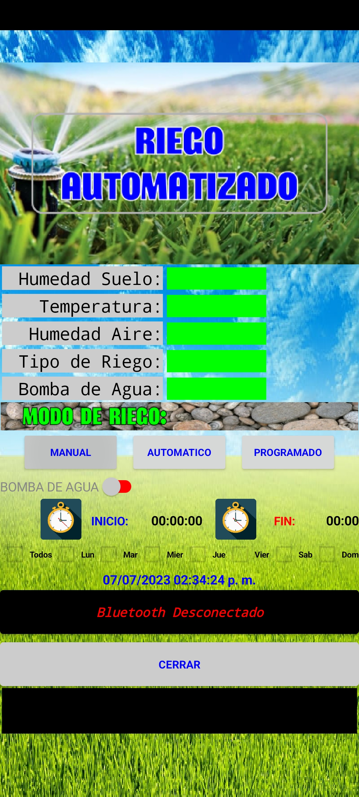
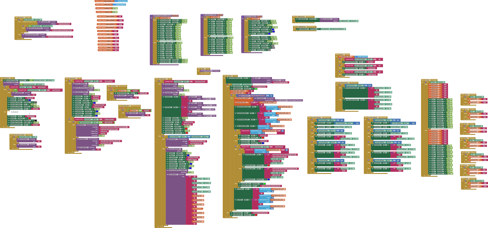
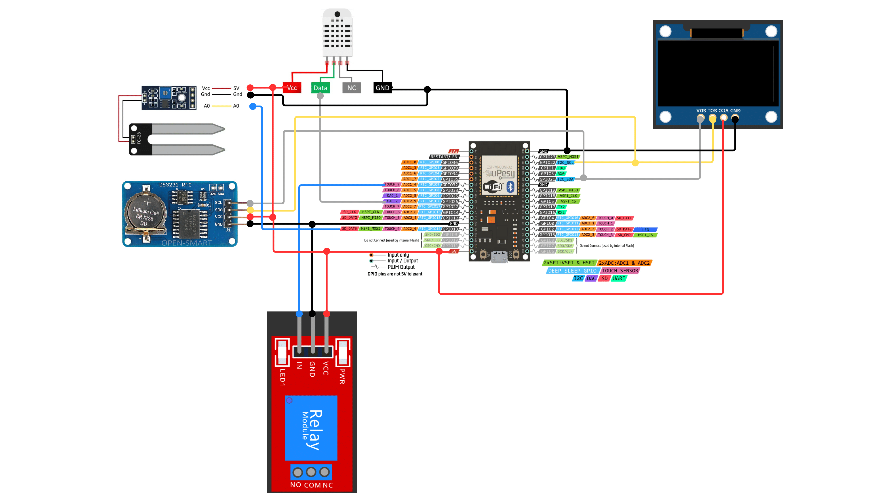

# Riego Automático con ESP32

Este repositorio contiene el código fuente para un sistema de riego automático desarrollado en Arduino utilizando ESP32. La lógica implementada combina diversas funcionalidades, como la lectura de sensores (humedad del suelo, temperatura y humedad ambiental), control de un relé para la bomba de agua, visualización en pantalla OLED, comunicación vía Bluetooth y programación de horarios utilizando un RTC DS3231. La app móvil fue creada en AIA usando "código en bloque" para facilitar la interacción con el sistema.

### App Screenshot




### App Block Code




### Connection Diagram



## Descripción

El sistema realiza las siguientes tareas:

- **Lectura de sensores:**  
  - **DHT11:** Para medir la temperatura y la humedad del ambiente.  
  - **Sensor de humedad del suelo:** Lee la humedad mediante una entrada analógica.

- **Control de riego:**  
  - **Modo Manual:** Permite encender o apagar la bomba manualmente.
  - **Modo Automático:** Activa la bomba cuando la humedad del suelo es baja (por debajo del 35%).
  - **Modo Programado:** Utiliza un reloj en tiempo real (RTC DS3231) y parámetros guardados en EEPROM para iniciar y finalizar el riego en horarios específicos y días seleccionados.

- **Interfaz de usuario:**  
  - **Pantalla OLED:** Muestra datos en tiempo real (humedad del suelo, temperatura, humedad ambiental, modo de riego, estado de la bomba y fecha/hora).  
  - **Comunicación Bluetooth:** Permite el envío y recepción de datos entre el ESP32 y una app móvil, facilitando la configuración y monitoreo del sistema.

## Características

- **Integración de sensores:**  
  Mide tanto variables ambientales (temperatura y humedad del aire) como la humedad del suelo.

- **Modos de operación:**  
  Soporta modos manual, automático y programado para adaptarse a distintas necesidades de riego.

- **Programación de horarios:**  
  Permite definir intervalos de tiempo y días específicos para el riego programado. Los parámetros se almacenan en EEPROM.

- **Visualización en OLED:**  
  Muestra información relevante en tiempo real, facilitando el monitoreo del sistema.

- **Conectividad Bluetooth:**  
  Intercambio de datos con una aplicación móvil para control y configuración remota.

## Requisitos de Hardware

- **ESP32:**  
  Utilizado como microcontrolador principal.
  
- **DS3231 RTC:**  
  Para mantener la hora y fecha precisas y permitir la programación de riegos.

- **DHT11:**  
  Sensor para medir la temperatura y la humedad ambiental.

- **Sensor de humedad del suelo:**  
  Lee la humedad del suelo a través de una entrada analógica.

- **Pantalla OLED (SSD1306):**  
  Visualiza los datos del sistema.

- **Relé:**  
  Para controlar el encendido y apagado de la bomba de agua.

- **Módulo Bluetooth:**  
  (Integrado en ESP32) para la comunicación con la app móvil.

## Requisitos de Software

- **Arduino IDE** o plataforma compatible para programar el ESP32.
- Librerías necesarias:
  - [Adafruit_GFX](https://github.com/adafruit/Adafruit-GFX-Library)
  - [Adafruit_SSD1306](https://github.com/adafruit/Adafruit_SSD1306)
  - [RTClib](https://github.com/adafruit/RTClib)
  - [DHT sensor library](https://github.com/adafruit/DHT-sensor-library)
  - [BluetoothSerial](https://github.com/espressif/arduino-esp32/tree/master/libraries/BluetoothSerial)
  - [Preferences](https://docs.espressif.com/projects/esp-idf/en/latest/esp32/api-reference/storage/nvs_flash.html)

## Instalación

1. **Clona este repositorio:**

   ```bash
   git clone https://github.com/tu-usuario/tu-repositorio.git
   ```

2. **Configura el entorno de desarrollo:**

   - Instala el [Arduino IDE](https://www.arduino.cc/en/software) (o usa PlatformIO).
   - Configura el soporte para ESP32 siguiendo la [guía oficial](https://docs.espressif.com/projects/arduino-esp32/en/latest/installing.html).

3. **Instala las librerías necesarias:**

   Desde el Administrador de Librerías del Arduino IDE, busca e instala cada una de las siguientes:
   - Adafruit_GFX
   - Adafruit_SSD1306
   - RTClib
   - DHT sensor library
   - BluetoothSerial (incluida con la plataforma ESP32)
   - Preferences (incluida en el ESP32 core)

4. **Conecta el hardware:**

   - Conecta el DS3231 al bus I2C (SDA y SCL).
   - Conecta la pantalla OLED al bus I2C.
   - Conecta el sensor DHT11 al pin 26.
   - Conecta el sensor de humedad del suelo al pin analógico 13.
   - Conecta el relé para la bomba de agua al pin 32.
   - Verifica que el módulo Bluetooth esté habilitado (configuración en `make menuconfig` si se usa ESP-IDF).

## Uso

1. **Carga del código:**  
   Abre el proyecto en el Arduino IDE y carga el código en tu ESP32.

2. **Interacción vía Bluetooth:**  
   - El ESP32 inicia en modo Bluetooth con el nombre "Riego_automatico_ESP32".
   - Conecta la app móvil creada en AIA para enviar comandos y configurar los modos de riego.
   - Los comandos recibidos via Bluetooth permiten seleccionar entre modos manual, automático y programado, así como configurar horarios y días para el riego.

3. **Visualización en OLED:**  
   La pantalla muestra continuamente la humedad del suelo, temperatura, humedad ambiental, modo de operación, estado de la bomba y la hora/fecha actual.

4. **Programación de riego:**  
   - El sistema utiliza el RTC DS3231 para verificar si el riego programado debe estar activo mediante la función `isScheduledON`.
   - Los parámetros de programación (hora de inicio, hora de fin, minutos y días de la semana) se almacenan en EEPROM usando la librería Preferences.

## Estructura del Código

- **setup():**  
  Inicializa los sensores, la pantalla OLED, el RTC, la comunicación Bluetooth y configura los pines de entrada/salida.

- **loop():**  
  Ejecuta el ciclo principal:
  - Lectura de sensores (DHT11 y sensor de humedad).
  - Gestión de comandos recibidos vía Bluetooth para cambiar el modo de riego.
  - Control del relé para encender o apagar la bomba según el modo seleccionado.
  - Actualización de la pantalla OLED y envío de datos a la app móvil.
  - Ejecución del riego programado según el RTC.

- **Funciones Auxiliares:**  
  - `encender_bomba(bool interruptor)`: Controla el relé para la bomba.
  - `mostrar_datos_x_oled()`: Muestra información en la pantalla OLED.
  - `enviar_datos_x_bluettoth()`: Envía datos al dispositivo conectado vía Bluetooth.
  - `guardar_en_EEPROM()`, `leer_de_EEPROM()`: Gestionan la lectura y escritura de parámetros en EEPROM.
  - `isScheduledON(DateTime date)`: Comprueba si, en función de la hora y el día, se debe activar el riego programado.

## Contribuciones

¡Las contribuciones son bienvenidas! Si deseas mejorar este proyecto o agregar nuevas funcionalidades, siéntete libre de abrir un *pull request* o crear un *issue* para discutir posibles mejoras.

## Licencia

Este proyecto se distribuye bajo la [Licencia MIT](LICENSE).

## Contacto

Para cualquier consulta o sugerencia, puedes contactarme a través de randolphfrp@gmail.com o abrir un *issue* en GitHub.

